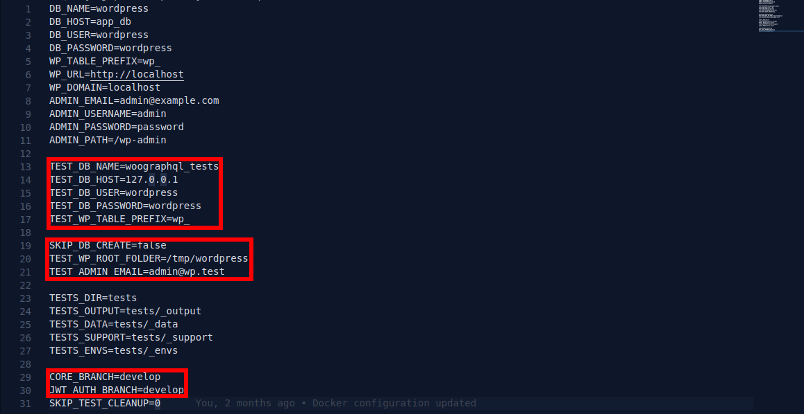

# Running Tests

This document provides information on running tests locally.

There are 2 options: 

- [Running tests with your own local environment](#local-tests) (faster, more room for environmental inconsistencies)
- [Running tests with Docker](#docker-tests) (slower, more consistent)

<span id="local-tests"></span>
## Running Tests with your own local environment

Below are instructions for running tests with your own local environment. Running tests this way is more flexible and faster than running tests with Docker. But, there's a chance your local environment (PHP versions, MySQL versions, etc) could change (as you work on other projects, for example), and that could cause problems with the test suite. 

If you follow the instructions below, you should be able to run tests locally with your own local environment. 

### Prerequisties
You must have the following available locally: 
- **PHP**
- **MySQL** (or equivalent such as MariaDB)
- **[Composer](https://getcomposer.org/doc/00-intro.md)** 
- **[WP-CLI](https://wp-cli.org/)** installed as well as terminal/shell/command-line access.


### Codeception & the wp-browser module
**WPGraphQL** and **WPGatsby** both use the **[Codeception](https://codeception.com/)** testing framework alongside the **[wp-browser](https://wpbrowser.wptestkit.dev/)** module created by [Luca Tumedei](https://www.theaveragedev.com/) for running the automated test suite. We'll be using Codeception scaffolding to generate all the tedious test code, but this will not be an in-depth guide on either of these libraries. It's not required to process with this tutorial, but it's highly recommended that after finishing this tutorial you take a look at the documentation for both.
- **[Codeception](https://codeception.com/docs/01-Introduction)**
- **[wp-browser](https://wpbrowser.wptestkit.dev/)**

1. Start by cloning **[WPGatsby](https://github.com/wp-gatsby/wp-gatsby)**.
2. Open your terminal.
3. Copy the `.env.dist` to `.env` by execute the following in your terminal in the **WPGatsby** root directory.
```
cp .env.dist .env
```
4. Open the .env and update the highlighted environmental variables to match your machine setup.

5. Last thing to do is run the WordPress testing environment install script in the terminal.
```
composer install-test-env
```

This will create and configure a WordPress installation in a temporary directory for the purpose of testing.

### Setting up Codeception
Now that we have setup our testing environment, let's run the tests. To do this we will need to install the **Codeception** and the rest of our **devDependencies**

1. First run `composer install` in the terminal.
2. Next copy the `codeception.dist.yml` to `codeception.yml`
```
cp codeception.dist.yml codeception.yml
```
3. Open `codeception.yml` and make the following changes.


Now you are ready to run the tests.

### Running the tests
Now your're ready to rum the tests. There is a small issue you may have with our testing environment. The WordPress installation we created doesn't support **end-to-end (*e2e*)** testing, however this won't be a problem. **WPGraphQL** is an API and most of the time you can get away with just ensuring that your query works, and **WPGraphQL** provides a few functions that will allow us to do just that.

Let's get started by running all the unit tests. Back in your terminal run the following:
```
vendor/bin/codecept run wpunit
```
If everything is how it should be you should get all passing tests.


You can also run individual test suites by specifying the path: 

```
vendor/bin/codecept run tests/wpunit/ActionMonitorTest.php
```

Or even run a single test by specifying the specific test:

```
vendor/bin/codecept run tests/wpunit/ActionMonitorTest.php:testActionMonitorQueryIsValid
```

<span id="docker-tests"></span>
## Running Tests with Docker

The automated tests that run in the Github workflows use Docker. This ensures the environment is always what we expect. No risk of inconsistencies with PHP versions, MySQL versions, etc. 

The trade off (at least as of right now) is that you must run the entire test suite instead of having the ability to run individual tests. And you must wait for the Docker environment to boot up. Overall, this is slower and less flexible than running tests with your own local environment, but it's more consistent. 

To run tests with Docker, run the following commands:

- `composer install`: This will install the composer dependencies needed for testing
- `composer build-test`: This will build a Docker environment. This can take some time, especially the first time you run it.
- `composer run-test`: This will run the tests in the Docker environment.
